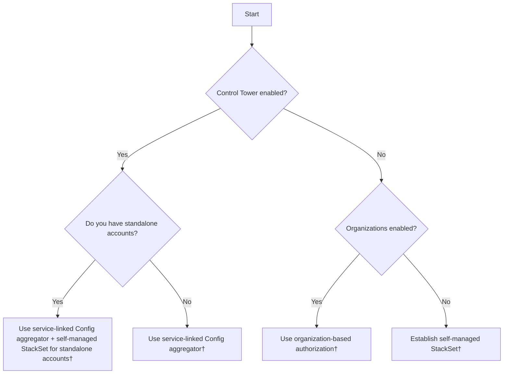

# Multiple Accounts, Multiple Regions

### **Recommended Architecture Pattern**
For a typical enterprise setup:
1. **Management Account**: Enroll in AWS Control Tower or create an AWS Organizations structure
2. **Delegated Administrator Account**: Designate a member account as the delegated administrator for AWS Config
3. **Security Tooling Account**: Deploy aggregator and central Config rules
4. **Central Region**: Select a consistent central region based on your requirements (e.g., compliance, user proximity, service availability, cost)
5. **Automation**: Automate the deployment of Config rules and conformance packs for new regions and accounts

### **Enable AWS Config across all accounts in all regions**

AWS Config is an account- and region-specific service. For customers running multiple AWS accounts, we recommend implementing AWS Config across your entire AWS Organizations. For customers running multiple AWS Regions, we also recommend enabling AWS Config in each region where you want to track resource configuration changes and compliance evaluations. You can accomplish this in three ways:

1. **Using AWS CloudFormation StackSets**: 
    [AWS CloudFormation StackSets](https://docs.aws.amazon.com/AWSCloudFormation/latest/UserGuide/what-is-cfnstacksets.html) provide pre-built templates for enabling AWS Config across multiple regions and accounts simultaneously, deploying the configuration recorder across your organization, and maintaining consistent settings across all accounts. To deploy AWS Config across your organization using AWS CloudFormation, [follow this blog](https://aws.amazon.com/blogs/mt/managing-aws-organizations-accounts-using-aws-config-and-aws-cloudformation-stacksets/).

2. **Using AWS Systems Manager Quick Setup**:
     [AWS Systems Manager Quick Setup](https://docs.aws.amazon.com/systems-manager/latest/userguide/systems-manager-quick-setup.html) offers a streamlined way to enable the Config recorder across your entire organization. To deploy AWS Config across your organization using AWS Systems Manager Quick Setup, [follow this blog](https://aws.amazon.com/blogs/mt/managing-configuration-compliance-across-your-organization-with-aws-systems-manager-quick-setup/).

3. **Using AWS Control Tower**:
    [AWS Control Tower](https://docs.aws.amazon.com/controltower/latest/userguide/what-is-control-tower.html) helps you set up and securely manage multiple AWS accounts from a central location. Starting with landing zone version 4.0, AWS Config is an optional integration that must be explicitly enabled during or after setup. When the AWS Config integration is enabled, AWS Control Tower deploys a service-linked Config recorder on enrolled accounts and a service-linked Config aggregator in the designated aggregator account. To get started with AWS Control Tower, refer to the [AWS Control Tower Getting Started documentation](https://docs.aws.amazon.com/controltower/latest/userguide/getting-started-with-control-tower.html).

If you're in the early stage of your AWS adoption journey, we recommend starting with AWS Control Tower to establish a secure and compliant multi-account environment. AWS Control Tower simplifies the setup process and ensures best practices are followed from the beginning. Ensure you enable the AWS Config integration during landing zone setup to benefit from detective controls and resource configuration tracking. Visit the [AWS Control Tower page](../../AWS%20Control%20Tower/index.md) to learn AWS Control Tower best practices.

### **Delegated Admin for AWS Config**

A delegated administrator for AWS Config is a designated member account within an AWS organization that receives permissions to manage configuration settings across the entire organization. This administrator can deploy and manage AWS Config rules, handle conformance packs, and aggregate configuration data from multiple accounts. They have visibility into resource configurations and compliance status across the organization, enabling centralized management and monitoring. 

We recommend using a delegated administrator for AWS Config to protect the management account by limiting its use to only essential organizational tasks while delegating AWS Config-specific administrative duties to designated member accounts. This approach follows the principle of least privilege, reduces security risks, and provides better operational control by centralizing Config management in designated accounts. 

We also recommend delegating to a central Security Tooling account as the delegated administrator account. This account is dedicated to managing security services and infrastructure. If you are using AWS Control Tower version 3.3 or lower, this Security Tooling account is named *Audit Account* by default. If you are using AWS Control Tower version 4.0 or higher, AWS Control Tower automatically configures AWS Config aggregator account as the delegated administrator for AWS Config. Refer to [AWS Prescriptive Guidance for AWS Security Reference Architecture](https://docs.aws.amazon.com/prescriptive-guidance/latest/security-reference-architecture/security-tooling.html) to learn more about the role of the Security Tooling account.

To use delegated admin for AWS Config operations and aggregation, [follow this blog](https://aws.amazon.com/blogs/mt/using-delegated-admin-for-aws-config-operations-and-aggregation/).

**Note**: You must use the AWS CLI to register a delegated administrator from the management account.

### **Organizational deployment of conformance packs and rules**

We recommend implementing organizational conformance packs for automatic deployment across your AWS Organization to establish a common baseline and consistent compliance standards. Conformance packs are integrated with AWS Organizations to deploy a collection of rules and actions as a single entity across an entire AWS Organization. Deploy conformance packs from the delegated administrator account. AWS CloudFormation StackSets can deploy stacks to new accounts added to the Organizations or organizational units (OUs). Refer to the [AWS CloudFormation User Guide](https://docs.aws.amazon.com/AWSCloudFormation/latest/UserGuide/stacksets-orgs-manage-auto-deployment.html) to learn more about the automatic deployment feature. 

Organization conformance packs are deployed using the [AWS CLI](https://docs.aws.amazon.com/cli/latest/reference/configservice/index.html#cli-aws-configservice) or [AWS API](https://docs.aws.amazon.com/config/latest/APIReference/API_PutConformancePack.html). You can exclude accounts but not by OU, and deployment is region-specific. For that reason, we recommend establishing organization-wide controls first, then region-wide controls next. Failures in individual accounts don't block deployment to other accounts, potentially creating silent compliance gaps. Implement monitoring to detect failed deployments.

[Follow this blog](https://aws.amazon.com/blogs/mt/deploying-conformance-packs-across-an-organization-with-automatic-remediation/) to learn how to automate deployment. To learn more about conformance pack, visit the [Compliance Management section](../Compliance%20Management/index.md)

***Note***: Organizational deployment for new accounts is only retried for 7 hours after an account is added without an available recorder. If you haven't implemented a strategy to [enable AWS Config automatically](#enable-aws-config-across-all-accounts-in-multiple-regions), you need to enable the recorder in the account within 7 hours.

### **Centralize AWS Lambda Functions for Rules Development Kit (RDK)**

In multi-account environments where multiple custom rules are required, it's recommended to centralize AWS Lambda functions in a single account. Custom rules from other accounts can then invoke these centralized functions. It is appropriate to use the Security Tooling account. You can designate shared service account outside of Security Tooling account if one of the following is true:

1. You have a separate team responsible for managing custom rules and associated Lambda functions.
2. You want to separate the responsibilities of security and infrastructure teams.
3. You have a specific requirement to isolate rule management and other security solutions from security administrator.

When using shared service account, we recommend that you evaluate when you need a separate shared services account.  Shared services accounts are part of infrastructure OU to support multiple teams. As you may have separate network administrators and services, you may have separate identity, security, and other shared services accounts. Start small, but plan to scale as your organization grows. 

### **Global Resource Management**

For rules evaluating global resources such as AWS IAM rules, deploy rules in one region to avoid duplicate costs and redundant API calls. This practice optimizes both cost efficiency and resource utilization while maintaining effective compliance monitoring. To identify global resources, check the Amazon Resource Name (ARN). The fourth field is empty if the resource is global. 

### **Cross-Account, Cross-Region Aggregation**

**Aggregator Limitations:**
- Each aggregator supports a maximum of 10,000 source accounts. 
- Maximum number of accounts in an AWS Organizations can be up to 50,000. 
- By default, maximum 1,000 accounts can be added or deleted per week across all aggregators. 
- Cannot create aggregator of aggregators.

For large Organizations structure or if you frequently churn AWS accounts, submit service quota increase to increase the limit for adding more than 1,000 accounts to aggregators. You will also need to create 5 aggregators to support 50,000 accounts, and define operational model for maintaining 5 aggregators. It's important to note that aggregated data can lag minutes behind source accounts. Plan monitoring and alerting strategies accordingly. We recommend one of the following approach.

1. Central S3 + Amazon Athena - Use [centralized delivery channel](#central-delivery-channel-s3-bucket) and Amazon Athena to query across all Config data regardless of aggregator limit. Refer to [this blog](https://aws.amazon.com/blogs/mt/exploring-aws-config-data-using-amazon-athena-and-amazon-managed-grafana/) and [AWS Prescriptive Guidance](https://docs.aws.amazon.com/prescriptive-guidance/latest/patterns/automate-aws-resource-inventory.html)

2. Build a query layer on top of 5 Aggregators - Split your organization into 5 AWS OU-based aggregators. Use AWS Lambda or AWS Step Functions to fan out queries to all 5 aggregators and merge the results. 

3. Third-party tooling - Third-party tools like [Streampipe](https://steampipe.io/) can query multiple AWS accounts and aggregators simultaneously through unified SQL interface.

#### **Aggregation Authorization**
As organizations enable AWS Config across multiple regions and accounts, it becomes crucial to centralize the data for comprehensive visibility and management. [AWS Config Aggregators](https://docs.aws.amazon.com/config/latest/developerguide/aggregate-data.html) consolidate configuration-related data from various regions and accounts into a single, designated aggregator account at no additional cost. This centralization provides a unified view of your AWS environment, enabling easier monitoring of Config rule evaluations, conformance pack assessments, and overall compliance status across your organization. To deploy an organization-wide aggregator, [follow this blog](https://aws.amazon.com/blogs/mt/org-aggregator-delegated-admin/).

Authorization refers to the permissions you grant to an aggregator account and region to collect your AWS Config configuration and compliance data. To set up cross-account, cross-region aggregation, we recommend you delegate authorization to an automated service. When AWS Config integration is enabled, AWS Control Tower deploys a service-linked Config aggregator (SLCA) in the designated aggregator account, which can aggregate data from any Config recorder in the organization — including accounts not managed by AWS Control Tower. This replaces the organization and account aggregators used in earlier landing zone versions. Without AWS Control Tower, we recommend organization-based authorization to eliminate overhead managing individual authorization accounts.

#### **Central Delivery Channel S3 Bucket**

We recommend selecting a single S3 bucket to send AWS Config configuration history files and configuration snapshots to. For AWS Control Tower version 3.3 or lower user, this is Log Archive account. For AWS Control Tower version 4.0 or higher user, when AWS Config integration is enabled in AWS Control Tower, a dedicated S3 bucket is created in the AWS Config service integration account designated for the `CentralConfigBaseline`, separate from the AWS CloudTrail bucket. This account is also known as the Audit account. Delivery channel is required and setup is for one per region per account. 

In multi-account or multi-region setup, querying S3 and building your own data table can help assess your environment quickly. 

Refer to S3 best practice to ensure your bucket is optimized.

#### **Central Region**

We recommend selecting a consistent *central region* across your organization. The *central region*, alternatively referred to as the *home region* or *aggregation region*, is the region where you deploy the AWS Config aggregator and other central services like the AWS Config delivery channel, Amazon S3 bucket for configuration snapshots, and Amazon SNS topic for notifications. Having a consistent *central region* helps streamline your AWS cross-account, cross-region strategy. Refer to [AWS Prescriptive Guidance for multi-region fundamentals](https://docs.aws.amazon.com/prescriptive-guidance/latest/aws-multi-region-fundamentals/fundamental-2.html) for general data considerations, and [AWS Region Usage](../../AWS%20Region%20Usage/index.md) for best practices on choosing your region strategy.

#### **Cross-Account Querying**

This aggregated data in the central account unlocks [advanced querying](https://docs.aws.amazon.com/config/latest/developerguide/querying-AWS-resources.html) capabilities. This feature allows you to perform complex queries across your AWS environment, providing insights into resource configurations and compliance states. For instance, you can easily identify all unattached Amazon EBS volumes across your accounts using simple SQL-like syntax. These advanced queries offer both operational and compliance-related data, enhancing your ability to manage and optimize your AWS infrastructure effectively.

#### **Centralized Compliance Across Services**

At scale, AWS Config functions as the compliance data plane for multiple AWS services. AWS Control Tower consumes Config rule evaluations to enforce detective controls. AWS Security Hub ingests Config findings to produce a unified security posture score. AWS Audit Manager pulls Config evaluation results into audit-ready evidence folders. When these services are deployed independently without a deliberate integration strategy, organizations encounter duplicate rule evaluations, conflicting compliance states across dashboards, and unnecessary cost from redundant configuration items.

To avoid this, treat the delegated administrator account as the single pane of glass for compliance orchestration. Deploy Config rules through conformance packs at the organization level, feed evaluations into Security Hub via the service-linked integration, and map Security Hub findings to Audit Manager frameworks. This creates a unidirectional data flow — Config records the evaluation, Security Hub normalizes the finding, and Audit Manager packages it as evidence — with no circular dependencies or duplicate processing. For a detailed walkthrough of this integration pattern, refer to [Unlock the Power of AWS Config: Centralized Compliance and Resource Management](https://aws.amazon.com/blogs/mt/unlock-the-power-of-aws-config-centralized-compliance-and-resource-management/).

**Recommendation**: Avoid enabling the same managed rule both as a standalone Config rule and as a Security Hub service-linked rule — this produces duplicate evaluations and inflates cost. Use Security Hub as the primary consumer of Config compliance data, and Audit Manager as the evidence layer. Establish a clear ownership model: the security team owns Security Hub findings, the compliance team owns Audit Manager frameworks, and the platform team owns the underlying Config rules and conformance packs.

