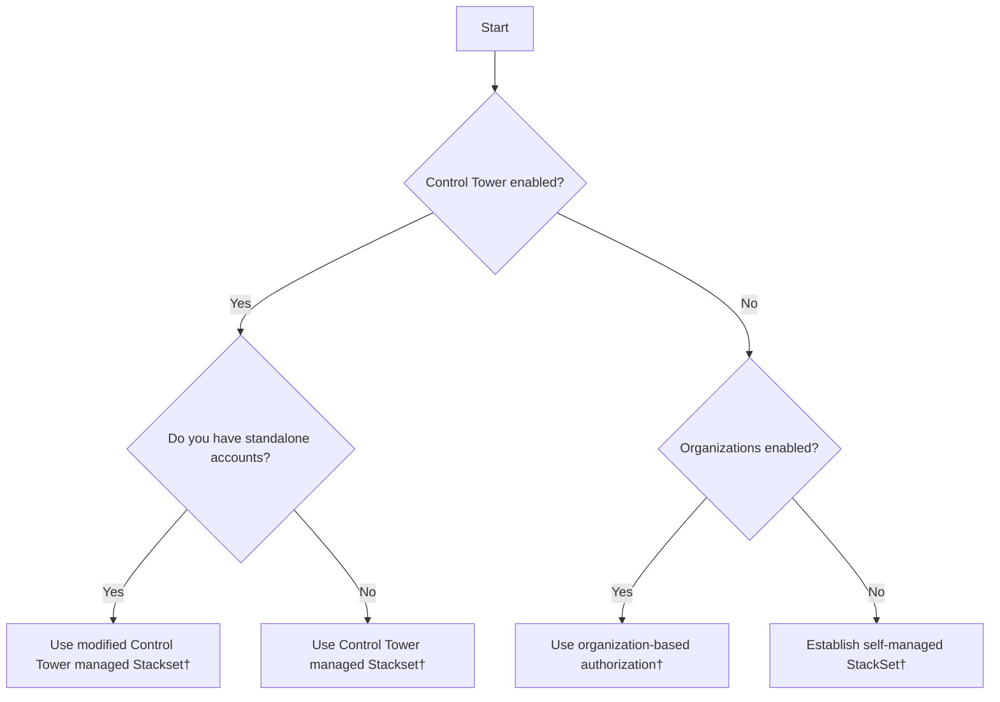

# Multiple Account, Multiple Regions

### **Recommended Architecture Pattern**
For a typical enterprise setup:
1. **Management Account**: Enroll in AWS Control Tower or create an AWS Organizations structure
2. **Delegated Administrator Account**: Designate a member account as the delegated administrator for AWS Config
3. **Security Tooling Account**: Deploy aggregator and central Config rules
4. **Primary Region**: Choose based on compliance requirements (e.g., us-east-1 for US companies)
5. **Conformance Packs**: Start with AWS Operational Best Practices packs
6. **Automation**: Automate the deployment of Config rules and conformance packs for new regions and accounts

### **Enable AWS Config across all accounts in multiple regions**

AWS Config is an account- and region-specific service. For customers running multiple AWS accounts, we recommend implementing AWS Config across your entire AWS Organizations. For customers running multiple AWS Regions, we also recommend enabling AWS Config in each region where you want to track resource configuration changes and compliance evaluations. You can accomplish this in three ways:

1. **Using CloudFormation StackSets**: 
    [CloudFormation StackSets](https://docs.aws.amazon.com/AWSCloudFormation/latest/UserGuide/what-is-cfnstacksets.html) provide pre-built templates for enabling AWS Config across multiple regions and accounts simultaneously, deploying the configuration recorder across your organization, and maintaining consistent settings across all accounts. To deploy AWS Config across your organization using CloudFormation, [follow this blog](https://aws.amazon.com/blogs/mt/managing-aws-organizations-accounts-using-aws-config-and-aws-cloudformation-stacksets/).

2. **Using AWS Systems Manager Quick Setup**:
     [AWS Systems Manager Quick Setup](https://docs.aws.amazon.com/systems-manager/latest/userguide/systems-manager-quick-setup.html) offers a streamlined way to enable the Config recorder across your entire organization. To deploy AWS Config across your organization using Systems Manager Quick Setup, [follow this blog](https://aws.amazon.com/blogs/mt/managing-configuration-compliance-across-your-organization-with-aws-systems-manager-quick-setup/).

3. **Using AWS Control Tower**:
    [AWS Control Tower](https://docs.aws.amazon.com/controltower/latest/userguide/what-is-control-tower.html) helps you set up and securely manage multiple AWS accounts from a central location. When enabled, Control Tower automatically activates AWS Config across all enrolled accounts. To get started with AWS Control Tower, refer to the [AWS Control Tower Getting Started documentation](https://docs.aws.amazon.com/controltower/latest/userguide/getting-started-with-control-tower.html).

If you're in the early stage of your AWS adoption journey, we recommend starting with AWS Control Tower to establish a secure and compliant multi-account environment. Control Tower simplifies the setup process and ensures best practices are followed from the beginning. Visit the [AWS Control Tower page](../../AWS\ Control\ Tower/index.md) to learn AWS Control Tower best practices.

### **Delegated Admin for AWS Config**

A delegated administrator for AWS Config is a designated member account within an AWS organization that receives permissions to manage configuration settings across the entire organization. This administrator can deploy and manage AWS Config rules, handle conformance packs, and aggregate configuration data from multiple accounts. They have visibility into resource configurations and compliance status across the organization, enabling centralized management and monitoring. 

We recommend using a delegated administrator for AWS Config to protect the management account by limiting its use to only essential organizational tasks while delegating AWS Config-specific administrative duties to designated member accounts. This approach follows the principle of least privilege, reduces security risks, and provides better operational control by centralizing Config management in designated accounts. 

We also recommend delegating to a central Security Tooling account as the delegated administrator account. This account is dedicated to managing security services and infrastructure. If you are using AWS Control Tower, this account is named *Audit Account* by default. Refer to [AWS Prescriptive Guidance for AWS Security Reference Architecture](https://docs.aws.amazon.com/prescriptive-guidance/latest/security-reference-architecture/security-tooling.html) to learn more about the role of the Security Tooling account.

To use delegated admin for AWS Config operations and aggregation, [follow this blog](https://aws.amazon.com/blogs/mt/using-delegated-admin-for-aws-config-operations-and-aggregation/).

**Note**: You must use the AWS CLI to register a delegated administrator from the management account.

#### **Organizational deployment of conformance packs and rules**

We recommend implementing organizational conformance packs for automatic deployment across your AWS Organization to establish a common baseline and consistent compliance standards. Conformance packs are integrated with AWS Organizations to deploy a collection of rules and actions as a single entity across an entire AWS Organization. AWS CloudFormation StackSets can deploy stacks to new accounts added to the Organizations or organizational units (OUs). Refer to the [AWS CloudFormation User Guide](https://docs.aws.amazon.com/AWSCloudFormation/latest/UserGuide/stacksets-orgs-manage-auto-deployment.html) to learn more about the automatic deployment feature. 

Organization conformance packs are deployed using the [AWS CLI](https://docs.aws.amazon.com/cli/latest/reference/configservice/index.html#cli-aws-configservice) or [AWS API](https://docs.aws.amazon.com/config/latest/APIReference/API_PutConformancePack.html). You can exclude accounts but not by OU, and deployment is region-specific. For that reason, we recommend establishing organization-wide controls first, then region-wide controls next. 

To get started with organization conformance packs, [follow this blog](https://aws.amazon.com/blogs/mt/deploying-conformance-packs-across-an-organization-with-automatic-remediation/) to learn how to automate deployment.

***Note***: Organizational deployment for new accounts is only retried for 7 hours after an account is added without an available recorder. If you haven't implemented a strategy to [enable AWS Config automatically](#enable-aws-config-across-all-accounts-in-multiple-regions), you need to enable the recorder in the account within 7 hours.

### **Cross-Account, Cross-Region Aggregation**

#### **Aggregation Authorization**
As organizations enable AWS Config across multiple regions and accounts, it becomes crucial to centralize the data for comprehensive visibility and management. [AWS Config Aggregators](https://docs.aws.amazon.com/config/latest/developerguide/aggregate-data.html) consolidate configuration-related data from various regions and accounts into a single, designated aggregator account at no additional cost. This centralization provides a unified view of your AWS environment, enabling easier monitoring of Config rule evaluations, conformance pack assessments, and overall compliance status across your organization. To deploy an organization-wide aggregator, [follow this blog](https://aws.amazon.com/blogs/mt/org-aggregator-delegated-admin/).

Authorization refers to the permissions you grant to an aggregator account and region to collect your AWS Config configuration and compliance data. To set up cross-account, cross-region aggregation, we recommend you delegate authorization to an automated service. AWS Control Tower uses StackSet to manage authorization on your behalf. Without AWS Control Tower, we recommend organization-based authorization to eliminate overhead managing individual authorization accounts.

#### **Primary Region**

We recommend selecting a consistent *primary region* across your organization. The *primary region*, alternatively referred to as the *home region* or *aggregation region*, is the region where you deploy the AWS Config aggregator and other central services like the AWS Config delivery channel, Amazon S3 bucket for configuration snapshots, and Amazon SNS topic for notifications. Having a consistent *primary region* helps streamline your AWS cross-account, cross-region strategy. Refer to [AWS Prescriptive Guidance for multi-region fundamentals](https://docs.aws.amazon.com/prescriptive-guidance/latest/aws-multi-region-fundamentals/fundamental-2.html) for general data considerations, and [AWS Region Usage](../../AWS\ Region\ Usage/index.md) for best practices on choosing your region strategy.

### **Cross-Account Querying**

This aggregated data in the central account unlocks [advanced querying](https://docs.aws.amazon.com/config/latest/developerguide/querying-AWS-resources.html) capabilities. This feature allows you to perform complex queries across your AWS environment, providing insights into resource configurations and compliance states. For instance, you can easily identify all unattached EBS volumes across your accounts using simple SQL-like syntax. These advanced queries offer both operational and compliance-related data, enhancing your ability to manage and optimize your AWS infrastructure effectively.

